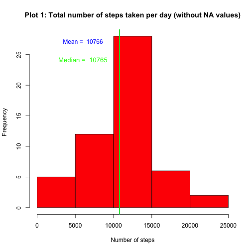
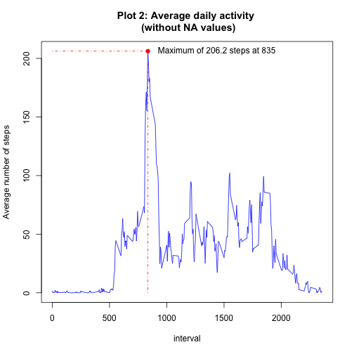
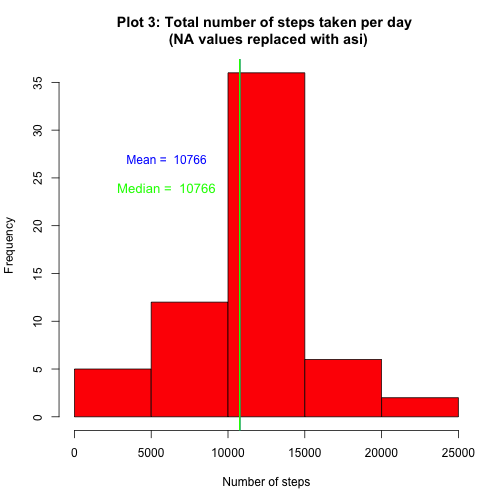
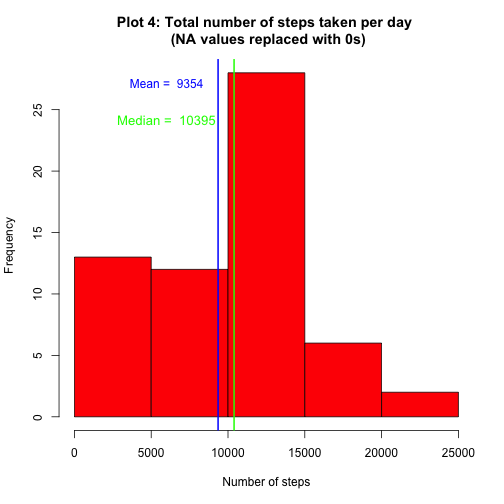
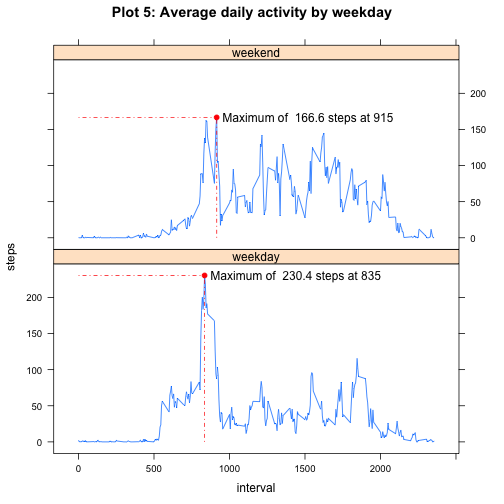

# Reproducible Research: Peer Assessment 1

This is the required Rmarkdown file for the 1st peer assessement of the Coursera course [Reproducible Research](https://class.coursera.org/repdata-002) by Prof. Peng.

A description of the assignment can be found [here](./README.md).

## 01. Loading and preprocessing the data

The first step is to load the data. These are already present in the forked repository so I don't need to download them again. However, they are originally zipped, so I unzip them if this has not already been done. The result is a text file in CSV format named *`activity.csv`*.

To read the unzipped data, I use the `read.csv()` function where I precise the classes of the three columns corresponding to the number of steps (integer class), the date (Date class), and the 5-minute identifier (integer class, see below) using the argument `colClasses`.

```r
if (!file.exists("activity.csv")) {
    unzip("activity.zip")
}
data <- read.csv("activity.csv", colClasses = c("integer", "Date", "integer"))
data <- data[order(data[, 2], data[, 3]), ]
```


Notice that I make sure that my data are ordered by date then by interval identifier.

A structure of the data can be viewed using the `str()` function as follows :


```r
str(data)
```

```
## 'data.frame':	17568 obs. of  3 variables:
##  $ steps   : int  NA NA NA NA NA NA NA NA NA NA ...
##  $ date    : Date, format: "2012-10-01" "2012-10-01" ...
##  $ interval: int  0 5 10 15 20 25 30 35 40 45 ...
```

The data frame `data` has 3 columns and 17568 observations as expected from the project description.


We can check that each day has 288 observations, corresponding to the 288 = 24x60/5 possible 5-minute intervals, using `table(data$date)`. We check as well that each 5-minute interval is present in the 61 days, from 2012-10-01 to 2012-11-30, using `table(data$interval)`. 

Notice that **the identifier for the 5-minute intervals has gaps at the end of each hour**. E.g.: the identifier jumps from 55 to 100. This correspond to times 00:55 and 01:00 respectively. Thus, the identifier runs from 0 to 2355 instead of from 0 to 1440 if it was a continuous label of 5-minute intervals (there are 1440 minutes a day ). **I will not convert this identifier to a time format.** This is justified by the x-axis of the time series plot showed as an exemple in the project description where we see clearely that the 5-minute identifier goes until about 2355. It makes sense to define it as an integer since it can be ordered. Reading the time of the identifier is straightforward without conversion. E.g.: 835 corresponds to the time 08:35.

The data up to this point need no additional processing or transformation for what follows. We will comment on the missing values `NA` later.

## 02.  What is the mean total number of steps taken per day?

In order to calculate the total number of steps taken per day, I use the `aggregate()` function with the formula `steps ~ date` and the argument `FUN = sum`. Missing values are excluded by default in the `aggregate()` function call when a formula is used. Thus, days where all steps number values are equal to `NA` will not be considered here. 

The result is stored in a new data frame named `tsd` (**t**otal **s**teps per **d**ay) which has two columns: `date` for the date, and `steps` for the total number of steps per day. 


```r
tsd <- aggregate(steps ~ date, data, FUN = sum)
str(tsd)
```

```
## 'data.frame':	53 obs. of  2 variables:
##  $ date : Date, format: "2012-10-02" "2012-10-03" ...
##  $ steps: int  126 11352 12116 13294 15420 11015 12811 9900 10304 17382 ...
```


It has 53 rows, which means that 8 days have `NA` values for the number of steps at each interval.

Then a histogram is plotted out of this new data frame with appropriate labeling of the axes and the plot. Notice that we have been asked to plot a histogram and not a barplot.


```r
hist(tsd$steps, xlab = "Number of steps", main = "Plot 1: Total number of steps taken per day (without NA values)", 
    col = "red")

## plot vertical lines for the median and the mean
abline(v = mean(tsd$steps), col = "blue", lwd = 2)
text(6000, 28, labels = paste("Mean = ", format(mean(tsd$steps))), col = "blue", 
    pos = 1, cex = 1)
abline(v = median(tsd$steps), col = "green", lwd = 2)
text(6000, 25, labels = paste("Median = ", format(median(tsd$steps))), col = "green", 
    pos = 1, cex = 1.1)
```

 


I didn't specify a value for the argument `breaks` as I think the resulting histogram is fine. The next refinement for the histogram is obtained using `breaks = 8`.

The histogram seems relatively symmetric and the total number of steps per day follows a unimodal distribution. The mean and the median associated with the total number of steps per day are shown by blue and green vertical lines. Their values are obtained as:

```r
mean(tsd$steps)
```

```
## [1] 10766
```

```r
median(tsd$steps)
```

```
## [1] 10765
```


These quantities are almost equal and the two vertical lines above are indistinguishable.

## 03. What is the average daily activity pattern?

In order to study the average daily activity, we will make a time series plot of the average number of steps taken, averaged across all days, as a function of the 5-minute intervals.

I use the `aggregate()` function again with the formula `steps ~ interval` and the argument `FUN = mean`. This will calculate, for a given 5-minute intervall, the mean of the number of steps taken across all days. The result is stored in a new data frame named `asi` (**a**verage **d**aily **a**ctivity) which has two columns: `interval` for the 5-minute interval identifier, and `steps` for the mean number of steps across all days. It has naturally 288 rows.


```r
asi <- aggregate(steps ~ interval, data, FUN = mean)
plot(steps ~ interval, asi, type = "l", ylab = "Average number of steps", col = "blue", 
    main = "Plot 2: Average daily activity \n (without NA values)")

## Plot a point at the maximum number of steps at the intersection of
## adequate horizontal and vertical lines
position <- asi[which.max(asi$steps), 1]
max <- max(asi$steps)
points(position, max, pch = 19, col = "red")
segments(x0 = 0, y0 = max, x1 = position, y1 = max, col = "red", lty = 4)
segments(x0 = position, y0 = 0, x1 = position, y1 = max, col = "red", lty = 4)
text(position, max, labels = paste("Maximum of", format(max), "steps at", format(position)), 
    pos = 4, offset = 1)
```

 

The average number of steps is almost zero until intervall 500, corresponding to time 05:00, and dies out approximately after 2100, corresponding to a time 21:00.

It peaks at 

```r
max(asi$steps)
```

```
## [1] 206.2
```

 steps in the morning for the 5-minute interval

```r
asi[which.max(asi$steps), 1]
```

```
## [1] 835
```


which corresponds to a time 8:35. This is shown as a red point at the intersection of guiding lines, corresponding to the height and position of the peak, in the plot. This seems to be the average time at which people leave home for their work. Its width extends to approximately 920, corresponding to a time 09:20 as can be seen from the ordering of `asi$steps` by decreasing average number of steps :


```r
head(asi[order(asi$steps, decreasing = TRUE), 1], n = 25)
```

```
##  [1]  835  840  850  845  830  820  855  815  825  900  810  905  910  915
## [15]  920 1550 1845 1545  925 1210 1215 1205 1850 1855 1840
```


It seems there is no other peak of the same intensity at the end of the day. This may hint to different times for the daily ending of work. Looking at the ordered `asi$steps`, it seems that 15:45 and 18:45 are the the most common times for people leaving their work. Notice also the peak arround 12:10 which would correspond to lunch time.


## 04. Imputing missing values

So far, we have not considered the missing values `NA`. In the following, we will devise a strategy to replace these missing values to include all dates in the study.

The total number of missing values in the dataset can be obtained from


```r
sum(!complete.cases(data))
```

```
## [1] 2304
```

 and this is exactly the same number of `NA` in the column `steps`

```r
sum(is.na(data$steps))
```

```
## [1] 2304
```


In order to define a strategy to fill these missing values, we need first to understand their structure in each day. The question is: How many `NA` do we have in each day ?

To answer the question, I first create a logical vector named `missing` using the `is.na()` function on `data$steps`, then I use again the `aggregate()` function with the formula `missing ~ date` and the argument `FUN = sum`. This results in a data frame named `na.sd` with two columns: `date` and `missing` for the number of missing value per day.


```r
missing <- is.na(data$steps)
na.sd <- aggregate(missing ~ date, data, FUN = sum)
head(na.sd)
```

```
##         date missing
## 1 2012-10-01     288
## 2 2012-10-02       0
## 3 2012-10-03       0
## 4 2012-10-04       0
## 5 2012-10-05       0
## 6 2012-10-06       0
```


For exemple, the date `2012-10-01` has 288 missing values, whereas the next day has none.

A table made out of all values of `missing` in `na.sd` yields

```r
table(na.sd$missing)
```

```
## 
##   0 288 
##  53   8
```


It turns out that each day has either all the steps values missing or none of them. There are exactly 8 days whose all steps are missing. 

There are indeed 53 days with no `NA` values and 8 days with 288 `NA` values for the number of steps, i.e `NA` values at each 5-minute interval.

Notice that we knew already that 8 days contain missing values for the number of steps from the fact that the data frame `tsd` had only 53 days while the total number of days is 61.

Given the fact above, a reasonable strategy is to fill the missing values of each 5-minute interval of those 8 days with the mean for that 5-minute interval obtained earlier. I create thus a new data frame named `datac` where I fill the days with missing values with the vector `asi$steps`. For this, I create a vector `vec` which is an 8 times, as in the number of days with `NA`s, replication of the vector `asi$steps`. Sine my 5-minutes interval idenifier is ordered, this procedure is safe.


```r
datac <- data
vec <- rep(asi$steps, 8)
datac[missing, 1] <- vec
```


Now, we can again calculate the total number of steps per day and plot the corresponding histogram

```r
tsdc <- aggregate(steps ~ date, datac, sum)
hist(tsdc$steps, , xlab = "Number of steps", main = "Plot 3: Total number of steps taken per day \n (NA values replaced with asi)", 
    col = "red")

## plot vertical lines for the median and the mean
abline(v = mean(tsdc$steps), col = "blue", lwd = 2)
text(6000, 28, labels = paste("Mean = ", format(mean(tsdc$steps))), col = "blue", 
    pos = 1, cex = 1)
abline(v = median(tsdc$steps), col = "green", lwd = 2)
text(6000, 25, labels = paste("Median = ", format(median(tsdc$steps))), col = "green", 
    pos = 1, cex = 1.1)
```

 

This looks very similar to the previous histogram. The only difference is the frequency of the central bin, which went from 28 to 36. This corresponds to exactly 8 additions to the mean value of the total number of steps per day, which are located in the central bin as we've seen earlier.

The new mean and median are given by

```r
mean(tsdc$steps)
```

```
## [1] 10766
```

```r
median(tsdc$steps)
```

```
## [1] 10766
```


Now the `mean` and `median` are exactly the same. This is no surprise since we've been filling 8 days with the exact same values corresponding to the mean value. 

Another possibility is to replace all `NA` values with zeros. Let's look at the resulting histogram


```r
data0 <- data
data0[missing, 1] <- 0
tsd0 <- aggregate(steps ~ date, data0, sum)
hist(tsd0$steps, , xlab = "Number of steps", main = "Plot 4: Total number of steps taken per day \n (NA values replaced with 0s)", 
    col = "red")

## plot vertical lines for the median and the mean
abline(v = mean(tsd0$steps), col = "blue", lwd = 2)
text(6000, 28, labels = paste("Mean = ", format(mean(tsd0$steps))), col = "blue", 
    pos = 1, cex = 1)
abline(v = median(tsd0$steps), col = "green", lwd = 2)
text(6000, 25, labels = paste("Median = ", format(median(tsd0$steps))), col = "green", 
    pos = 1, cex = 1.1)
```

 


Now the histogram changed completely and is logically biased towards 0 values. The mean and median are given by


```r
mean(tsd0$steps)
```

```
## [1] 9354
```

```r
median(tsd0$steps)
```

```
## [1] 10395
```


The mean being smaller than te median indicates that the distribution of the total number of steps per day became left skewed. This is obviously a bad strategy for replacing missing values in the data set.


## 05. Are there differences in activity patterns between weekdays and weekends?

So far, we have not considered the difference in activity pattern between weekdays and weekends. We can expect such a difference to occur, e.g.: the peak in the morning observed in the time series plot of the average number of steps across all day has no reason to be as strong during the weekends as it is in the weekdays.

To do this, we create a factor vector in the dataset `datac` with two levels: `weekday` and `weekend`. I first create a logical vector `inweekdays` whose values depend on whether the dates in `datac` are weekdays or weekends. Then I define the factor vector `weekday` out of `inweekends` with the labels argument `labels = c('weekday', 'weekend')`. Finally I add the `weekday` variable to the data frame `datac`. Notice that the output of `weekdays()` depends on the locale for the R process. Thus, 1989-03-31 corresponds to 'Friday' in english and 'Vendredi' in french. In order to avoid problems when people from different countries and different languages run the present script, I turn-off the locale and the output of `weekdays()` is then in english.


```r
## Turn-off the locale language setting This is to avoid problems when people
## in different countries use this script
Sys.setlocale(category = "LC_TIME", "C")
```

```
## [1] "C"
```

```r
inweekends <- weekdays(datac$date) %in% c("Saturday", "Sunday")
weekday <- factor(as.character(inweekends), labels = c("weekday", "weekend"))
datac$weekday <- weekday
```


Now we can make a time series plot similar to the one above but split according to the value of the new `weekday` variable. To do this, I use again the `aggregate()` function but this time with the formula `steps ~ interval + weekday`. The time series plot is done using the function `xyplot` from the `lattice` graphic system with the formula `steps ~ interval | weekday`.

```r
library("lattice")
avg <- aggregate(steps ~ interval + weekday, datac, mean)
xyplot(steps ~ interval | weekday, avg, layout = c(1, 2), main = "Plot 5: Average daily activity by weekday", 
    panel = function(x, y) {
        ## Plot a point at the maximum number of steps at the intersection of
        ## adequate horizontal and vertical lines
        position <- x[which.max(y)]
        max <- max(y)
        panel.xyplot(x, y, type = "l")
        lpoints(position, max, pch = 19, col = "red")
        panel.segments(x0 = 0, y0 = max, x1 = position, y1 = max, col = "red", 
            lty = 4)
        panel.segments(x0 = position, y0 = 0, x1 = position, y1 = max, col = "red", 
            lty = 4)
        panel.text(position, max, paste("Maximum of ", format(max), "steps at", 
            format(position)), pos = 4)
    })
```

 


Now the peak observed earlier appears to be indeed related to weekdays and work hours. It's height is even bigger now for weekdays.
